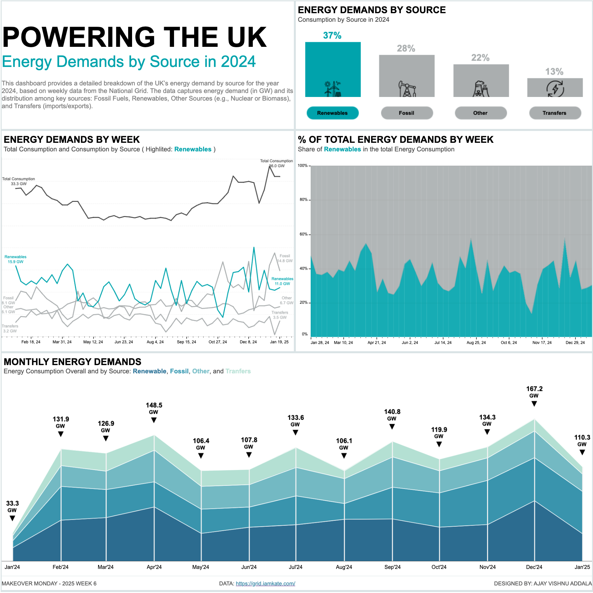

# Powering the UK: Weekly Energy Consumption by Source in 2024  

  

## Overview  
This project visualizes the UK’s energy consumption trends in 2024 using weekly data from the National Grid. The dashboard highlights energy demand and its breakdown by source, including Fossil Fuels, Renewables, Other Sources, and Transfers.  

The aim is to provide an interactive and insightful way to explore the dynamics of energy consumption and supply throughout the year.  

## Features  
- Weekly energy demand (in GW) visualized by source.  
- Interactive filtering and drill-down options for deeper analysis.  
- Trends showcasing the role of each energy source in meeting demand.  

## Data Source  
The dataset includes:  
- **Date:** The week of observation.  
- **Demand (GW):** Total energy demand.  
- **Fossil Fuels (GW):** Energy generated from fossil fuels.  
- **Renewables (GW):** Energy generated from renewable sources.  
- **Other Sources (GW):** Includes nuclear and biomass energy.  
- **Transfers (GW):** Imported/exported energy contributions.  

## Tableau Dashboard  
You can explore the interactive dashboard on Tableau Public: [Powering the UK Dashboard](https://public.tableau.com/views/UKEnergyDemandsin2024MOM2025W6/UKEnergyConsumption?:language=en-US&publish=yes&:sid=&:redirect=auth&:display_count=n&:origin=viz_share_link)  
